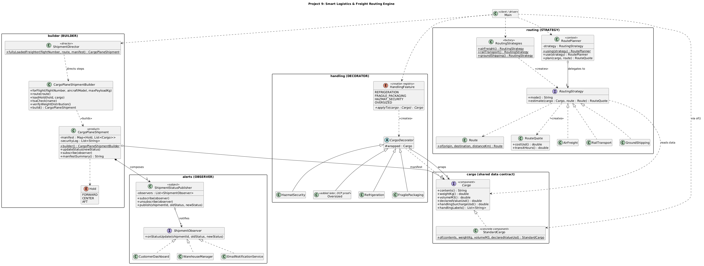
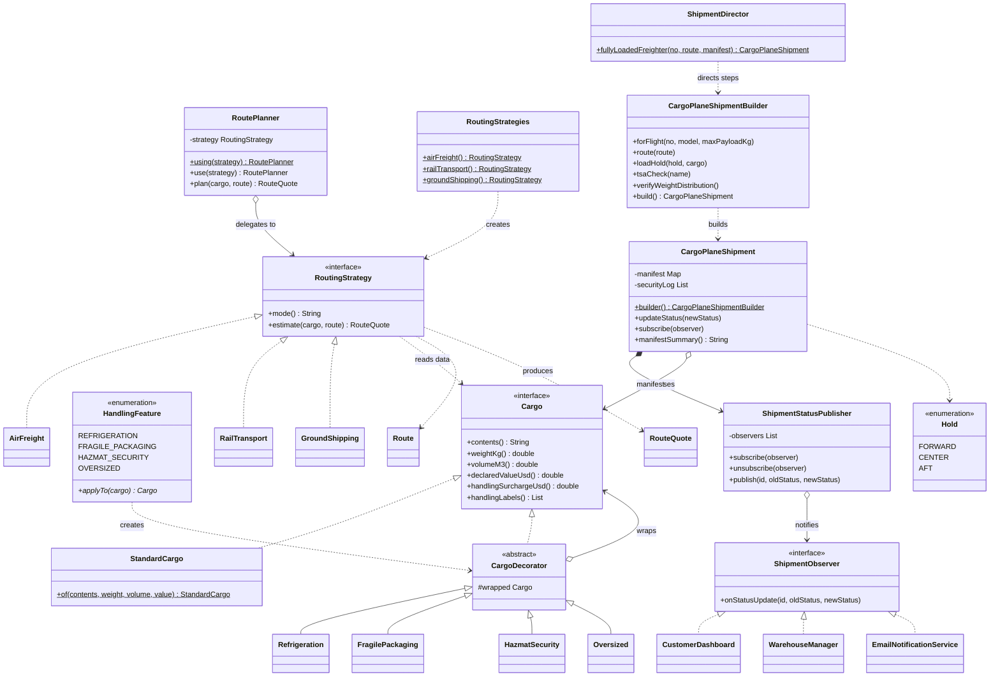

# Project 9: Smart Logistics & Freight Routing Engine

| Team member | Student ID | Email |
| --- | --- | --- |
| Vusal Ismayilov | Y3240009 | vusal.ismayilov@std.medipol.edu.tr |
| Javad Khalilov | Y3240010 | javad.khalilov@std.medipol.edu.tr |

Backend logistics engine for a global shipping company. Shipments start as plain `StandardCargo`, gain optional handling capabilities at runtime, get priced and scheduled by interchangeable routing algorithms, are assembled into a fully loaded cargo plane through a guarded multi-step build process, and broadcast every status change to all interested parties.

Plain Java 17, no external dependencies.

## Build and run

```bash
cd sdt/final
javac -d out $(find src -name "*.java")
java -cp out com.example.logistics.Main
```

## Pattern map

| Pattern | Package | Key types | Requirement covered |
| --- | --- | --- | --- |
| **Builder** (creational) | `builder/` | `CargoPlaneShipmentBuilder`, `ShipmentDirector`, `CargoPlaneShipment` | Multi-step construction of a loaded `CargoPlane` with manifest, weight distribution, and TSA checks, hidden from client code |
| **Decorator** (structural) | `handling/` | `CargoDecorator`, `Refrigeration`, `FragilePackaging`, `HazmatSecurity`, `Oversized` | Optional handling features stacked dynamically at runtime on a base `StandardCargo` |
| **Strategy** (behavioral) | `routing/` | `RoutingStrategy`, `AirFreight`, `RailTransport`, `GroundShipping`, `RoutePlanner` | Cost and transit time computed by interchangeable algorithms, swappable at runtime |
| **Observer** (behavioral) | `alerts/` | `ShipmentObserver`, `ShipmentStatusPublisher`, `CustomerDashboard`, `WarehouseManager`, `EmailNotificationService` | Status changes automatically notify multiple independent parties |

Shared data contract: `cargo/Cargo.java` (interface) and `cargo/StandardCargo.java` (base unit). The driver is `Main.java`.

## UML class diagram



Rendered from the PlantUML source at [`uml/class-diagram.puml`](uml/class-diagram.puml). The same model in Mermaid:



## How each pattern is implemented

### Builder

- Product: `builder/CargoPlaneShipment.java`. Its constructor is package-private, so the only way to obtain one is through the builder. A shipment that exists is a shipment that passed every validation.
- Builder: `builder/CargoPlaneShipmentBuilder.java`. Steps are `forFlight`, `route`, `loadHold`, `tsaCheck`, `verifyWeightDistribution`. `build()` rejects missing flight specs, empty manifests, payload over the aircraft maximum, an unverified weight distribution, and any missing check from `REQUIRED_TSA_CHECKS`.
- Director: `builder/ShipmentDirector.fullyLoadedFreighter(...)` encapsulates the whole recipe, including heaviest-first greedy balancing across the three holds so no hold exceeds 45% of payload. Client code gets a finished shipment in one call and never sees the steps.

### Decorator

- Component: `cargo/Cargo.java`. Concrete component: `cargo/StandardCargo.java`.
- Base decorator: `handling/CargoDecorator.java` wraps a `Cargo` and delegates everything by default. Each feature overrides only what it changes, for example `Refrigeration` adds reefer weight and a power surcharge, `HazmatSecurity` adds the label that routing strategies price against.
- Runtime stacking: the driver iterates over a `List<HandlingFeature>` and reassigns `cargo = feature.applyTo(cargo)`, so the feature set is data, not code. Any order, any combination.

### Strategy

- Interface: `routing/RoutingStrategy.java` with one algorithm method, `estimate(cargo, route)`.
- Three algorithms with genuinely different math: `AirFreight` (per-kg pricing, IATA hazmat multiplier, cruise speed plus ground handling), `RailTransport` (cheap per kg, fixed marshalling-yard delay), `GroundShipping` (per-km pricing, driver rest stops, ADR escort fee).
- Context: `routing/RoutePlanner.java` holds the current strategy and swaps it at runtime via `use(...)`. The driver quotes the same decorated cargo with all three algorithms by swapping strategies on one planner instance.

### Observer

- Subject: `alerts/ShipmentStatusPublisher.java` with `subscribe`, `unsubscribe`, `publish`.
- Observer interface: `alerts/ShipmentObserver.java`, a single callback.
- Three independent subscribers: `CustomerDashboard`, `WarehouseManager`, `EmailNotificationService`. Each reacts in its own way to "Delayed due to weather" and "Out for Delivery".
- Integration: `CargoPlaneShipment.updateStatus(...)` stores the new status and publishes the transition. The driver also demonstrates unsubscribing (the warehouse manager goes off shift and stops receiving alerts).

## SOLID adherence, with code references

### SRP, routing math fully separated from cargo data

- `cargo/Cargo.java` and `cargo/StandardCargo.java` expose physical and commercial attributes only. They contain zero cost or transit-time computation and have **no imports from the `routing` package**.
- Every pricing and scheduling formula lives in the strategy classes: `AirFreight.estimate(...)`, `RailTransport.estimate(...)`, `GroundShipping.estimate(...)`. The strategies read cargo data (`weightKg()`, `handlingLabels()`) and produce a `RouteQuote`.
- `RoutePlanner` also holds no math, it only delegates (`RoutePlanner.plan(...)`).
- Quick proof: `grep -rE "import com.example.logistics.routing" src/com/example/logistics/cargo src/com/example/logistics/handling` returns nothing.

### OCP, new handling features require zero changes to base cargo classes

- `handling/Oversized.java` was written after the rest of the system as the required proof. Adding it meant one new subclass of `CargoDecorator` plus one registry constant in `HandlingFeature`. `Cargo.java`, `StandardCargo.java`, and `CargoDecorator.java` were untouched, and so were all routing, builder, and alert classes.
- Same property on the other axes: a new transport mode is one new `RoutingStrategy` implementation (`RoutePlanner` unchanged), and a new alert channel is one new `ShipmentObserver` implementation (`ShipmentStatusPublisher` unchanged).

### Supporting principles

- **LSP**: every decorated cargo is substitutable wherever `Cargo` is expected. `ShipmentDirector` loads plain and decorated cargo through the same `loadHold(...)`, and strategies quote both without knowing the difference.
- **ISP**: interfaces are minimal. `ShipmentObserver` has one method, `RoutingStrategy` has one algorithm method plus a name.
- **DIP**: `RoutePlanner` depends on the `RoutingStrategy` abstraction (concrete strategies are package-private and unreachable from client code), and `ShipmentStatusPublisher` knows subscribers only through `ShipmentObserver`.

## Creation is fully decoupled from client logic

`Main.java` contains **zero `new` keywords**. All object creation goes through:

- static factories: `StandardCargo.of`, `Route.of`, `RoutePlanner.using`, `CustomerDashboard.forCustomer`, `WarehouseManager.onDuty`, `EmailNotificationService.to`
- the decorator registry: `HandlingFeature.applyTo(cargo)`
- the strategy factory: `RoutingStrategies.airFreight()` and friends
- the director: `ShipmentDirector.fullyLoadedFreighter(...)`

Verify: `grep -c "new " src/com/example/logistics/Main.java` matches only the word "new" inside a banner string.

## Driver simulation

`Main.java` runs five sections that prove each constraint in order:

1. **Decorator**: stacks Refrigeration, FragilePackaging, and HazmatSecurity onto a vaccine pallet at runtime, printing weight, surcharge, and labels after each layer.
2. **Strategy**: quotes the same decorated shipment Istanbul to Frankfurt with all three routing algorithms, swapped at runtime on one planner.
3. **Builder**: the director assembles flight MEP-441 with a six-cargo manifest, balanced holds, and the full TSA battery. A second build attempt that skips the TSA battery is rejected by `build()`, proving construction is guarded.
4. **Observer**: three parties subscribe, two status changes broadcast to all, the warehouse manager unsubscribes, the next change reaches only the remaining two.
5. **OCP proof**: the late-added Oversized feature wraps a turbine blade and flows through the existing routing pipeline unchanged.

<details>
<summary>Full console output</summary>

```text
====================================================================================================
1. DECORATOR | optional handling features stacked at runtime
====================================================================================================
base               Pharma vaccines (4 pallets)  |    1,200 kg |    3.2 m3 | value $    480,000 | handling $     0.00 | [no labels]
+ REFRIGERATION    Pharma vaccines (4 pallets)  |    1,380 kg |    4.1 m3 | value $    480,000 | handling $   620.00 | KEEP-FROZEN(-18C)
+ FRAGILE_PACKAGING Pharma vaccines (4 pallets)  |    1,449 kg |    4.1 m3 | value $    480,000 | handling $ 7,895.00 | KEEP-FROZEN(-18C), FRAGILE-THIS-SIDE-UP
+ HAZMAT_SECURITY  Pharma vaccines (4 pallets)  |    1,464 kg |    4.1 m3 | value $    480,000 | handling $ 8,289.90 | KEEP-FROZEN(-18C), FRAGILE-THIS-SIDE-UP, HAZMAT-CLASS-3

====================================================================================================
2. STRATEGY | one shipment, three interchangeable routing algorithms
====================================================================================================
Route: Istanbul (IST) -> Frankfurt (FRA) (2,180 km)
AirFreight      | cost $  10,390.75 | transit    8.6 h | IATA dangerous-goods surcharge x1.35
RailTransport   | cost $   8,652.52 | transit   60.3 h | segregated hazmat wagon x1.15
GroundShipping  | cost $  11,217.18 | transit   41.9 h | ADR escort vehicle +$500

====================================================================================================
3. BUILDER | director assembles a fully loaded CargoPlane
====================================================================================================
Shipment MEP-441 | Airbus A310-300F | Istanbul (IST) -> Frankfurt (FRA) (2,180 km)
Payload 30,819 kg of 39,000 kg max (79.0% load factor)
  FORWARD hold |   10,464 kg (34.0% of payload)
    - Steel coils (9,000 kg)
    - Pharma vaccines (4 pallets) (1,464 kg)
  CENTER  hold |    9,755 kg (31.7% of payload)
    - Coffee beans (6,500 kg)
    - Server racks (3,255 kg)
  AFT     hold |   10,600 kg (34.4% of payload)
    - Automotive parts (5,400 kg)
    - Textile bales (5,200 kg)
TSA security log:
    PASS X-ray manifest scan
    PASS Explosives trace detection
    PASS Dangerous goods declaration audit
    PASS Chain-of-custody seal verification
Status: Created | subscribers: 0
Guarded construction: build() rejected MEP-442 -> missing TSA check: X-ray manifest scan

====================================================================================================
4. OBSERVER | independent parties alerted on every status change
====================================================================================================
  [DASHBOARD] Acme Pharma GmbH       | MEP-441 is now "Departed IST cargo terminal" (was "Created")
  [WAREHOUSE] D. Kaya                | MEP-441 "Departed IST cargo terminal" -> action: update yard plan
  [EMAIL]     to ops@acme.example    | subject: "MEP-441 update: Departed IST cargo terminal"

  [DASHBOARD] Acme Pharma GmbH       | MEP-441 is now "Delayed due to weather" (was "Departed IST cargo terminal")
  [WAREHOUSE] D. Kaya                | MEP-441 "Delayed due to weather" -> action: hold outbound dock slot, keep cargo in climate bay
  [EMAIL]     to ops@acme.example    | subject: "MEP-441 update: Delayed due to weather"
  -- warehouse manager goes off shift, unsubscribed --

  [DASHBOARD] Acme Pharma GmbH       | MEP-441 is now "Out for Delivery" (was "Delayed due to weather")
  [EMAIL]     to ops@acme.example    | subject: "MEP-441 update: Out for Delivery"

====================================================================================================
5. OCP PROOF | new Oversized feature, zero changes to base classes
====================================================================================================
Wind turbine blade           |   11,800 kg |  120.0 m3 | value $  1,250,000 | handling $   400.00 | OVERSIZED-LOAD
GroundShipping  | cost $   1,274.00 | transit   11.2 h | -

====================================================================================================
Simulation complete: Builder, Decorator, Strategy, Observer all exercised
====================================================================================================
```

</details>

## Division of labor

| Student | Packages | Patterns |
| --- | --- | --- |
| Vusal Ismayilov (Y3240009) | `builder/`, `handling/` | Builder (shipment construction), Decorator (cargo handling wrappers) |
| Javad Khalilov (Y3240010) | `routing/`, `alerts/` | Strategy (routing algorithms), Observer (status alert publisher and subscribers) |
| Shared | `cargo/`, `Main.java` | Data contract and driver |

## Grading checklist

| Criterion | Where to look |
| --- | --- |
| UML class diagram | This README and `uml/class-diagram.puml` |
| Creational pattern, creation decoupled | `builder/` package, plus zero `new` keywords in `Main.java` |
| Structural and behavioral patterns | `handling/` (Decorator), `routing/` (Strategy), `alerts/` (Observer) |
| SOLID and readme references | "SOLID adherence" section above, with file and method references |
| Driver simulation and output | `Main.java`, full output captured above |
